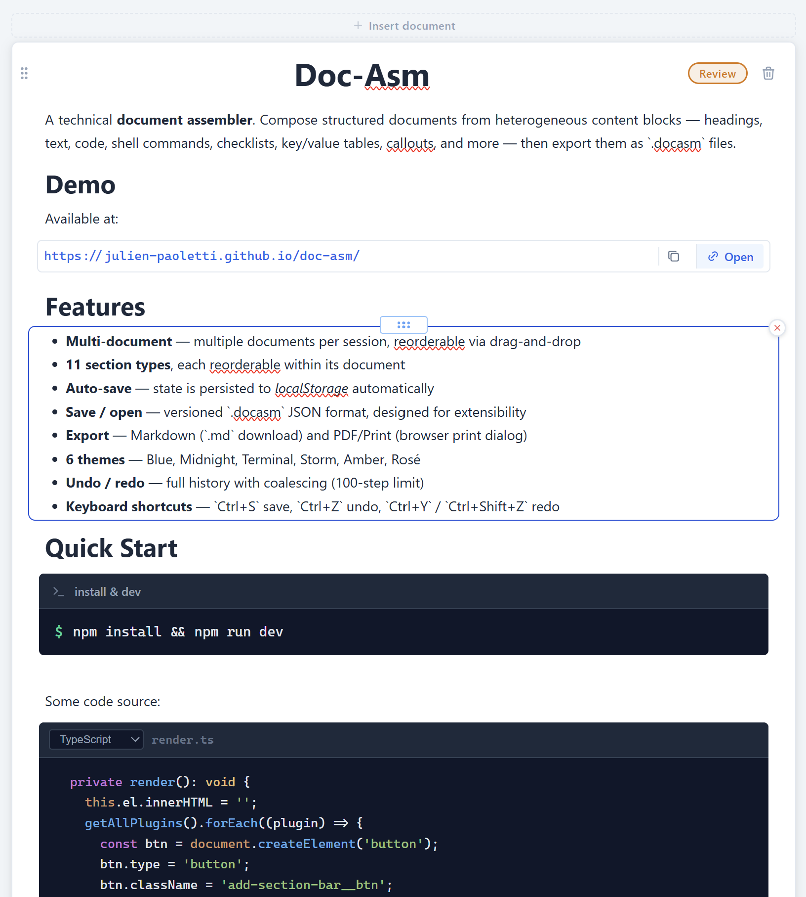

# Doc-Asm

> A technical document assembler for developers. Compose structured documents from heterogeneous content blocks, then export to `.docasm`, Markdown, or PDF.

[](https://github.com/julien-paoletti/doc-asm/actions)
[](LICENSE)
[](https://julien-paoletti.github.io/doc-asm/)

> **[Try the live demo →](https://julien-paoletti.github.io/doc-asm/)**



## Features

- **Multi-document** — multiple documents per session, reorderable via drag-and-drop
- **11 section types**, each reorderable within its document
- **Auto-save** — state is persisted to `localStorage` automatically (1 s debounce)
- **Save / open** — versioned `.docasm` JSON format, designed for extensibility
- **Export** — Markdown (`.md` download) and PDF/Print (browser print dialog)
- **6 themes** — Blue, Midnight, Terminal, Storm, Amber, Rosé
- **Undo / redo** — full history with coalescing (100-step limit)
- **Keyboard shortcuts** — `Ctrl+S` save, `Ctrl+Z` undo, `Ctrl+Y` / `Ctrl+Shift+Z` redo

| Section | Description |
| --- | --- |
| Heading | H1, H2, H3 |
| Text | Rich paragraph (`contenteditable`) with inline formatting |
| Code block | Editor with language selector and syntax highlighting |
| Shell command | Command block with optional label |
| Checklist | Checkboxes with indent levels and keyboard navigation |
| Key-value | Key/value table (env vars, API parameters…) |
| Callout | Highlighted block — info, warning, danger, tip |
| Separator | Horizontal line or blank space (S/M/L sizes) |
| Link | List of URLs with copy and open actions |
| Image | Drag-and-drop image upload, stored as base64 |
| Architecture diagram | Archie viewer for `.json` diagram files |

## Stack

| | Purpose |
| --- | --- |
| TypeScript + Vite | Strongly-typed, framework-free build |
| [Highlight.js](https://highlightjs.org/) | Syntax highlighting |
| [SortableJS](https://sortablejs.github.io/Sortable/) | Drag-and-drop reordering |
| [Tabler Icons](https://tabler.io/icons) | Icon set |
| [@julien-paoletti/archie-viewer](https://github.com/julien-paoletti/archie) | Architecture diagram renderer |

## Quick start

```bash
npm install
npm run dev
```

The app is available at `http://localhost:5173`.

## Build

```bash
npm run build   # tsc + vite build → dist/
npm run preview # preview the build
```

## Architecture

```plain
src/
├── components/       # App shell, document editor, section editor
├── dnd/              # SortableJS abstraction
├── export/           # Markdown and print/PDF export
├── persistence/      # .docasm serialization / deserialization, auto-save
├── sections/         # One folder per section type (plugin + co-located CSS)
│   ├── registry.ts   # Plugin registry
│   ├── archie/
│   ├── callout/
│   ├── checklist/
│   ├── code/
│   ├── heading/
│   ├── image/
│   ├── keyvalue/
│   ├── link/
│   ├── separator/
│   ├── shell/
│   └── text/
├── store/            # Reactive state (fine-grained ChangeScope, undo/redo)
├── styles/           # Reset, app globals, editor layout
└── utils/            # ID, clipboard, icons, arrays, debounce
```

### Adding a section type

Each section is a plugin implementing `SectionPlugin<TData>`:

```typescript
export const MyPlugin: SectionPlugin<MyData> = {
  typeId: 'my-type',
  label: 'My type',
  icon: icon('myIcon'),
  defaultData: { /* … */ },
  createEditor(data, onChange) {
    const el = document.createElement('div');
    // build the DOM, call onChange({ field }) on every change
    return { el };
  },
};
```

Then register it with `registerPlugin(MyPlugin)` in `src/main.ts`.

## File format (`.docasm`)

```json
{
  "version": 1,
  "documents": [
    {
      "id": "…",
      "title": "My document",
      "status": "draft",
      "sections": [
        { "id": "…", "type": "heading", "data": { "level": "h2", "text": "Introduction" } }
      ]
    }
  ]
}
```

The `data` field is opaque per section type; the `version` field enables future migrations. Document `status` is one of `draft`, `review`, or `done`.

## Deployment

The project deploys automatically to GitHub Pages via GitHub Actions on every push to `main`.

> **Prerequisite**: enable Pages in the repository settings → *Source: GitHub Actions*

## Contributing

Contributions are welcome — feel free to open an issue or submit a pull request.

## License

MIT
